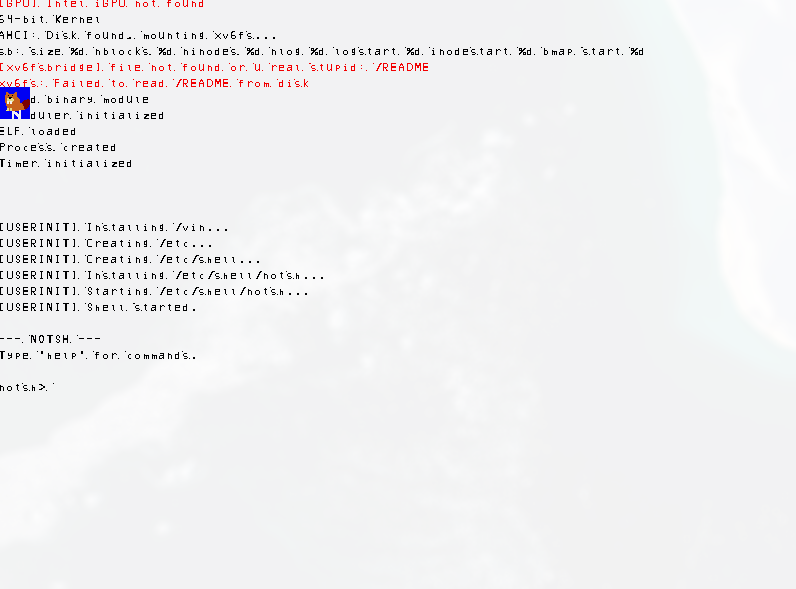

<div align="center">


# notux-kernel

**A GPL-free, Linux-like, clean-room 64-bit kernel — solo dev project**

[](LICENSE)
[](#)
[](#)
[](#)
[](#)
[](#)

[English](#english) • [Русский](#русский)

</div>

---

### We all love beavers
### MITL total victory

### About

**notux-kernel** is a solo-developer, clean-room, 64-bit kernel inspired by Linux but built without any GPL-licensed code. It's an educational/experimental project — **not intended for production use** — exploring what it takes to build a kernel capable of natively running Linux-style applications, complete with its own filesystem stack and a "token" root system.

The filesystem layer is built on a ported version of **xv6fs** (from the [xv6](https://github.com/mit-pdos/xv6-public) teaching operating system for x86/RISC-V), originally authored by Russ Cox, Frans Kaashoek, Robert Morris, Eddie Kohler, and others at MIT PDOS.

### Features

- 🧠 Freestanding **x86_64** kernel, boots via GRUB/Multiboot
- ⚙️ Core low-level subsystems: GDT, IDT, PIC, LAPIC, interrupt/exception handling (ISR/IRQ)
- 🧩 Memory management: physical memory manager (PMM), virtual memory manager (VMM), paging
- 🔀 Basic process management and scheduler
- 📞 Syscall interface (C + assembly stubs)
- 🖥️ Graphics: VGA and VBE framebuffer drivers (C and Zig implementations), 8x8 bitmap font renderer
- ⌨️ Drivers: PS/2 keyboard, serial (UART), PCI enumeration, AHCI (SATA), Intel iGPU probing
- 🗂️ Multiple filesystem backends:
  - **xv6fs** — ported from xv6
  - **RAM FS** — simple in-memory filesystem
  - **chachaFS** — custom C++ filesystem experiment
- 🌐 Mixed-language kernel: **C**, **C++**, **Zig**, and **x86-64 assembly (NASM)** side by side
- 📦 Boots as an ISO image via GRUB, runnable in QEMU

### Project structure

```
notux-kernel/
├── LICENSE
├── README.md
├── makefile              # Main build system (GNU Make)
├── linker.ld             # Kernel linker script
├── boot/
│   └── boot.asm          # Bootstrap assembly (Multiboot entry)
└── kernel/
    ├── build.zig         # Partial/experimental Zig build definition
    ├── console.c/.h      # Text console output
    ├── gdt.*, idt.*      # x86 descriptor tables
    ├── isr.asm, irq.asm, isrc.c   # Interrupt/exception handling
    ├── pic.*, lapic/     # Interrupt controllers (PIC / Local APIC)
    ├── paging.*, pmm.*, vmm.*     # Memory management
    ├── process.*, scheduler.c    # Processes & scheduling
    ├── syscall.*, syscalls.asm   # System call interface
    ├── keyboard.*, serial.*      # Input / UART drivers
    ├── pci.*, ahci/               # PCI bus, AHCI/SATA driver
    ├── IGPU/                      # Intel iGPU probing
    ├── vga.*, vbe.*, gfx.*, font*.* , logo.h  # Graphics stack
    ├── ramfs.*, ramfspawn.c       # RAM-backed filesystem
    ├── xv6fs/                     # Ported xv6 filesystem glue
    ├── chachaFS/                  # Custom experimental filesystem (C++)
    ├── Xjail/xv6/                 # Ported xv6 headers & filesystem core
    ├── onion.c                    # Kernel entry / init glue
    └── types.h, stdint.h, io.h    # Common definitions
```



### Requirements

To build notux-kernel you'll need:

- `gcc` / `g++` (with freestanding support)
- `nasm` (x86 assembler)
- `ld` (GNU linker)
- `zig` (for the Zig-based modules)
- `grub-mkrescue` + `xorriso` (to build the bootable ISO)
- `qemu-system-x86_64` (to run it)

### Build & run

```bash
git clone https://github.com/notux-dev/notux-kernel.git
cd notux-kernel

make          # build the bootable ISO
make run      # run it in QEMU
make clean    # clean build artifacts
```

> ⚠️ Note: the build currently expects a pre-built `fs.img` (produced via xv6's `mkfs` tool) and a userland binary (`user.elf`) — see the `makefile` for details. As this is an active work-in-progress, some build steps may need manual tweaking depending on your toolchain versions.

### Roadmap

- [ ] Stabilize and unify the memory management subsystem (PMM/VMM/paging)
- [ ] Flesh out the process scheduler (preemptive multitasking)
- [ ] Expand syscall coverage toward Linux-like ABI compatibility
- [ ] Mature chachaFS into a usable, documented filesystem
- [ ] SMP support (multi-core, beyond single LAPIC init)
- [ ] Networking stack (basic NIC driver + IP stack)
- [ ] Userland libc / basic toolchain for native apps
- [ ] Automated CI build across supported toolchains
- [ ] Broader hardware/driver support (beyond AHCI/PCI/iGPU basics)

*(Roadmap is indicative and subject to change — this is a solo, experimental project.)*

### Disclaimer

This kernel is written **for learning and experimentation purposes**. It is **not production-ready**, not security-audited, and should not be used to run untrusted code or in any critical environment.

### Contributing

This started as a solo project, but contributions, bug reports, and ideas are welcome:

1. Fork the repository
2. Create a feature branch (`git checkout -b feature/my-feature`)
3. Commit your changes with clear messages
4. Open a Pull Request describing what/why

Please keep clean-room principles in mind — **do not copy GPL-licensed code** into the project (this includes Linux kernel sources). Ported code (like xv6fs) must retain proper attribution to its original authors.

Bug reports and design discussions are welcome via [Issues](https://github.com/notux-dev/notux-kernel/issues).

### License

Licensed under the **MIT License** — see [LICENSE](LICENSE) for details.

Portions of the filesystem code are ported from **xv6**, © Russ Cox, Frans Kaashoek, Robert Morris, Eddie Kohler and contributors (MIT-licensed teaching OS from MIT PDOS).

---
